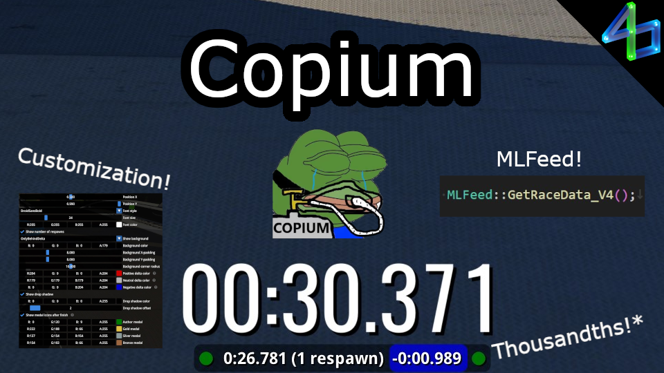

# Copium

Tells you what time you've could've gotten without respawns.

Largely based off of [No-Respawn Timer](https://openplanet.dev/plugin/norespawntimer) with better calculation, visibility, and customization.

Requires [MLFeed](https://openplanet.dev/plugin/mlfeedracedata) dependency (and therefore [MLHook](https://openplanet.dev/plugin/mlhook)).

*Thousandths are not perfectly accurate - may be off by a couple.

<!--  -->
<!--  -->
<!--  -->

